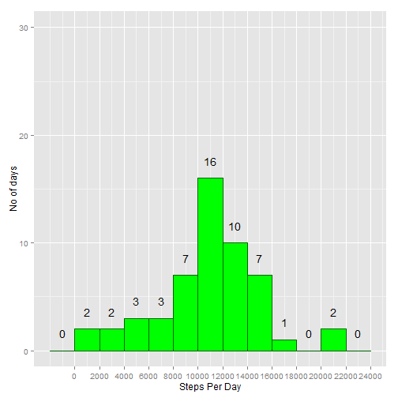
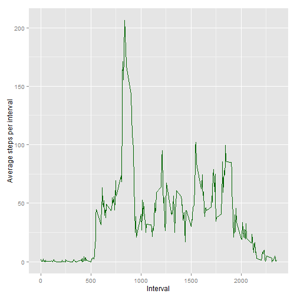
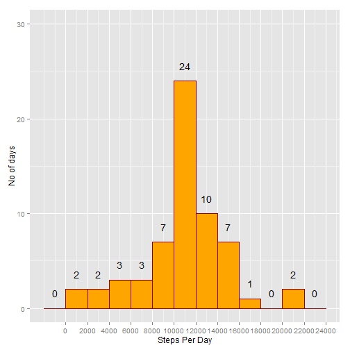
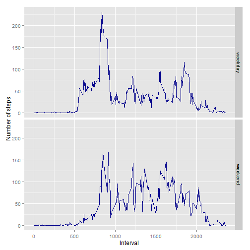

## Loading and preprocessing the data
Initial load of the .csv file that has to be located in the same folder.
Assign directly classes to the different variables as well as the string that represents the NA values.


```r
thedata<-read.csv("activity.csv",colClasses = c("integer","Date","integer"),na.strings = "NA",header=TRUE)
```


## What is mean total number of steps taken per day?
In order to remove the na's from the dataset, we will create a new dataset that will only inlcude the complete cases and will also calculate the total number of steps per day

```r
library(dplyr)

stepsperday<-thedata%>%
        filter(complete.cases(.))%>%
        group_by(date)%>%
        summarise(steps=sum(steps))
```

  

The following plot shows the frequency of total number of steps taken each day. A range of 3000 steps was used in order to group the data in a way that will provide insightfull data.


```r
library(ggplot2)

m<-ggplot(stepsperday,aes(x=steps))
m+geom_histogram(colour = "darkgreen", fill = "green",binwidth=2000)+
        ylim(c(0, 30))+
        stat_bin(binwidth=2000,geom="text", aes(label=..count..), vjust=-1.5)+
        labs(x="Steps Per Day", y="No of days") +
        scale_x_continuous(breaks=seq(0,24000,2000))
```

 

The mean of the total number of steps taken per day is: **mean =10766.19** and the median is: **median= 10765**. 


## What is the average daily activity pattern?
Calculation of the average of steps per interval for all days as well as of the numbers of NAs per interval
and the number of total measurements per interval.


```r
stepsperintervalclean<-thedata%>%
        filter(complete.cases(.))%>%
        group_by(interval)%>%
        summarise(steps=mean(steps))
```

And the time series plot that occurs is:


```r
m2<-ggplot(stepsperintervalclean,aes(x=interval,y=steps))
m2+geom_line(colour = "darkgreen")+
        labs(x="Interval", y="Average steps per interval")
```

 

The most active internal of the day is **835**

## Imputing missing values
The initial dataset has **2304 na values** where the number of steps were not measured.
  
In order to fill the values with NAs we will have first to check the number of missing values
per interval in comparison with the number of total measurements for each interval.
This way we will know if it will be wise to use the average steps from all the days for the specific interval. 


```r
stepsperinterval<-thedata%>%
        group_by(interval)%>%
        summarise(average=mean(steps,na.rm=TRUE),NAs=sum(is.na(steps)),values=n())
summary(stepsperinterval$NAs/stepsperinterval$values)
```

```
##    Min. 1st Qu.  Median    Mean 3rd Qu.    Max. 
##  0.1311  0.1311  0.1311  0.1311  0.1311  0.1311
```

It seems that there is no reason to further analyse the numbers since in every case only 13.11% of the values are missing.
So, we will replace the NAs with the average number of steps for this interval.


```r
##Bring the average steps to the table with the initial data
mergeddata<-merge(thedata,stepsperinterval,by="interval")

## Replace the NA values with the average
mergeddata$steps[is.na(mergeddata$steps)] <- mergeddata$average[is.na(mergeddata$steps)]


stepsperdayoptimised<-mergeddata%>%
        group_by(date)%>%
        summarise(steps=sum(steps))
```

  

The following plot shows the frequency of total number of steps taken each day with the optimised data were the average steps per interval was used to replace the missing NA values. A range of 3000 steps was used in order to group the data in a way that will provide insightfull data.


```r
library(ggplot2)

m2<-ggplot(stepsperdayoptimised,aes(x=steps))
m2+geom_histogram(colour = "darkred", fill = "orange",binwidth=2000)+
        ylim(c(0, 30))+
        stat_bin(binwidth=2000,geom="text", aes(label=..count..), vjust=-1.5)+
        labs(x="Steps Per Day", y="No of days") +
        scale_x_continuous(breaks=seq(0,24000,2000))
```

 

The mean of the total number of steps taken per day is: **mean =10766.19** and the median is: **median= 10766.19**. 
  
  As you can see there is a slight difference in the resulting median as well as the histogram. The mean seems to be the same due mainly to the strategy that we chose to use for replacing the NA values.
  Also, the histogram shows an increase in the number of days with steps from 10.000 to 12.000 since we filled in the NA values with the average of the steps per each interval.


## Are there differences in activity patterns between weekdays and weekends?

```r
##Find the day of the week
mergeddata$theday<-as.factor(weekdays(mergeddata$date))

##Set all daes to weekday
mergeddata$theweekend<-"weekday"

## Update only the values for the weekends.
mergeddata$theweekend[mergeddata$theday=="Saturday"|mergeddata$theday=="Sunday"] <- "weekend"
```

The following plot shows the average number of steps taken per interval for the weekdays and the weekends.


```r
stepsperintervaloptimised<-mergeddata%>%
        group_by(interval,theweekend)%>%
        summarise(steps=mean(steps))


m3<-ggplot(stepsperintervaloptimised,aes(x=interval,y=steps))
m3+geom_line(colour = "darkblue")+
        labs(x="Interval", y="Number of steps")+
        facet_grid(theweekend~.)
```

 


